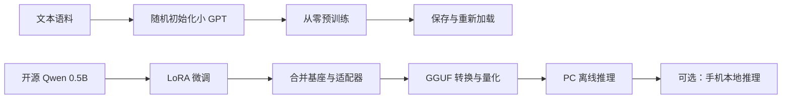

# 4GB 显存电脑：从零预训练、微调与本地部署学习路线

面向你的设备：i7-11800H / RTX 3050 Laptop 4GB / 内存 16GB。资料核对日期：2026-09-11。

**结论：现有电脑足以完成三个目标的教学实践，先不买硬件，也不需要租 GPU。** 采用小规模实验，完整经历数据准备、训练、评估、保存、加载和部署。训练速度与显存占用仍需要在你的 Windows 电脑实测；本文没有在该设备上跑过训练。

你已确认有编程经验、没有模型训练经验。本路线重点补 PyTorch 和机器学习基础；操作系统暂按 Windows 10/11、投入暂按每周 6～8 小时安排。若不熟悉 Python，只补函数、类、文件、模块和环境管理等用到的部分，不必从一般编程概念重学。时间表是学习安排，不是训练耗时承诺。

## 先理解三个目标的关系

| 目标 | 初始状态 | 做什么 | 得到什么 |
| --- | --- | --- | --- |
| 从零预训练 | 模型权重随机初始化 | 用普通文本反复训练“预测下一个 token” | 能模仿语料风格的小语言模型 |
| 微调 | 已有预训练/指令模型 | 用任务输入和理想回答训练；本路线用 LoRA | 基座模型配套的适配器，以及合并后的模型 |
| 端侧部署 | 已有训练好的模型 | 把权重加载到用户设备，执行推理 | 不依赖云端模型的本地程序或应用 |

Token 是模型处理文本的单位，可以是字、词片段或其他符号，不一定等于一个汉字。参数是模型中学习得到的数值；0.5B 约为 5 亿参数。

预训练和微调通常都用梯度下降，只是起始权重、数据组织和更新的参数范围不同。SFT 指用示范答案做有监督微调；LoRA 指只训练少量附加参数的方法，二者可以同时使用。量化用更少的位数表示权重，以减少存储和运行开销。

本路线有两条实验支线：



小 GPT 用来理解训练原理；Qwen 用来练习实用微调和部署。不要求把字符级小 GPT 转成 Qwen，也不要求自己的小模型具备聊天能力。

## 设备能做什么

| 实践 | 起步配置 | 判断与边界 |
| --- | --- | --- |
| 从零预训练 | 4 层、4 头、隐藏维度 128，约 0.8M 参数 | 很适合作为第一轮；跑通后升到隐藏维度 256、约 3.2M 参数 |
| LoRA 微调 | Qwen2.5-0.5B-Instruct，长度 256，batch 1，r=8 | 作为 4GB 显存的起步尝试；开启梯度检查点并实测余量 |
| QLoRA 微调 | 同一个 0.5B 模型，4bit 基座 | 作为 LoRA 显存不足的备选和后续对比实验 |
| PC 部署 | 0.5B 的量化模型，单会话，短上下文 | 首选；完成后再尝试 1.5B 的量化推理 |
| 7B 全参数训练 | 不纳入本路线 | 显存和训练成本都不合适 |
| 手机部署 | 先用 0.5B 的 4bit 模型 | 要另外确认手机系统、芯片、内存；不是仅凭这台 PC 就能判断 |

上表参数量是字符小词表下的近似计算，最终以脚本打印为准。4GB 是显存总量，桌面显示、浏览器和其他程序会占用其中一部分。建议先保留数百 MB 的余量，不把 4096MB 用满。

解释一个常见误区：0.5B 模型的 FP16 权重约为 1GB（十进制），不代表训练只要 1GB。训练还需梯度、优化器状态、激活和临时张量；常见 AdamW 全参数训练仅模型相关状态就可能达到每参数约 12～16 字节，具体取决于精度与实现。LoRA 大幅降低可训练参数相关开销，但基座前向、反向传播中的激活仍然占显存。

磁盘足够用。建议在 D 盘预留 40～60GB 给学习环境、模型缓存、导出文件和检查点；这是预算，不是必须一次占满的容量。C 盘继续留给系统和安装程序。避免第一天下载几十 GB 的数据集。

模型选择依据：[Qwen2.5-0.5B-Instruct 官方模型卡](https://huggingface.co/Qwen/Qwen2.5-0.5B-Instruct)列出了约 0.49B 参数和中文支持。它是本指南选用的成熟教学对象，不是在推荐“最新或最强”的模型。

## 推荐学习顺序：8 周，按验收结果推进

| 时间 | 核心内容 | 动手任务 | 验收标准 |
| --- | --- | --- | --- |
| 第 0 次，1～2 小时 | 先知道模型怎么使用 | 安装 Ollama，运行 0.5B 模型，再断网尝试 | PC 本地生成回答；知道推理不是训练 |
| 第 1 周 | Python / PyTorch 最小基础 | tensor、shape、矩阵乘法、autograd，拟合 y=2x+1 | 能解释 forward、loss、backward、step |
| 第 2 周 | Decoder-only Transformer | token、embedding、位置、因果注意力、MLP、softmax | 跟踪一个 batch 从 token ID 到 logits 的形状 |
| 第 3 周 | 从零预训练第一轮 | 小 GPT，100 步排错，再 2000 步正式实验 | 权重随机初始化，训练和验证 loss 都有记录，能生成文本 |
| 第 4 周 | 理解训练行为 | 改一个参数重跑；重新加载；练习恢复训练 | 对比两次实验；解释过拟合和 checkpoint |
| 第 5 周 | 微调的数据与基线 | 定义单一任务，整理 200～500 条示例并划分数据 | 有独立验证/测试集，有基座模型的评估记录 |
| 第 6 周 | LoRA 微调 | 先 10 步检查，再 1～3 个 epoch；必要时试 QLoRA | 保存适配器，重新加载，对照基座评估 |
| 第 7 周 | 部署自己的模型 | 合并、转 GGUF、量化、Ollama 导入、API 调用 | 本地程序可调用微调模型，下载完成后能断网运行 |
| 第 8 周 | 复盘与扩展 | 整理实验报告；可选研究 Android 本地推理 | 能复现自己的结果，知道下一项改进是什么 |

每周建议两次 2 小时实操、一次 2 小时阅读与记录。有余力再加时；不需要先读完全部理论再训练。

## 三个项目的最终作业

**项目 A：从随机数到文本生成器。** 训练一个英文字符级 GPT，保存训练曲线或日志，使用同一个提示比较训练前后输出。英文小语料能减少词表、编码和数据质量上的干扰；跑通后，再换成已获使用许可的中文文本和自己的 tokenizer。字符分词没有 BPE 词表训练过程，这个差异要能说清楚。

**项目 B：把现有模型调整到一个明确任务。** 例如将客户留言分类成固定 JSON。先测原模型，再微调，最后测独立测试集。目标是学会监督信号、数据清洗、训练控制和评估；如果基座已经很好，微调没有提升甚至下降，也是有价值的实验结果。

**项目 C：把自己的微调结果变成可调用的本地服务。** 从保存的 adapter 出发，合并同一基座、导出 GGUF、量化、加载、调用本地 API，并比较导出前后结果。手机作为扩展，不作为完成前三项目标的必要条件，因为 PC 本地部署已经属于端侧部署。

## 操作指南

1. [环境安装与从零预训练](./01-环境与预训练.md)：Windows / PowerShell、CUDA 验证、小 GPT 训练与恢复。
2. [LoRA 微调与评估](./02-LoRA微调.md)：数据格式、完整教学代码、显存配置和评估方法。
3. [PC 部署与手机扩展](./03-端侧部署.md)：Ollama 体验、模型合并、GGUF、量化和本地 API。

文中的 Windows 路径是你在目标电脑上建立的目录。当前 Codex 工作区位于另一台 macOS 设备，本文没有在当前机器安装 Windows/CUDA 环境，也没有替你启动长时间训练。

## Happy-LLM 怎么读

| 阶段 | 对应阅读 | 先掌握什么 |
| --- | --- | --- |
| 基础 | [第 1 章](../docs/chapter1/第一章%20NLP基础概念.md) | token、文本表示；传统 NLP 的历史部分可以先略读 |
| 架构 | [第 2 章](../docs/chapter2/第二章%20Transformer架构.md)、[第 3 章](../docs/chapter3/第三章%20预训练语言模型.md) | 注意力、因果遮罩、Decoder-only；不用先完整复现所有架构 |
| 预训练 | [第 4 章](../docs/chapter4/第四章%20大语言模型.md)、[第 5 章](../docs/chapter5/第五章%20动手搭建大模型.md) | tokenizer、数据、loss、优化、保存；把 nanoGPT 对应到 LLaMA 结构 |
| 微调 | [第 6 章](../docs/chapter6/第六章%20大模型训练流程实践.md) | SFT、LoRA、QLoRA；暂缓 DeepSpeed 多卡配置 |
| 评估 | [第 7 章](../docs/chapter7/第七章%20大模型应用.md)的评测部分 | 建立固定测试集，避免凭一次聊天判断模型好坏 |

仓库原始示例包含更大模型、Linux 路径和多卡配置，不应在 4GB 电脑上原封不动执行。先完成这份小规模路线，再回头迁移仓库第 5、6 章的实现。第 8 章的强化学习和远端服务暂时不在你的三项目标内。

## 最小知识清单

- Python：函数、类、列表/字典、文件与 JSON、虚拟环境、异常、模块导入。
- 数学：向量/矩阵、矩阵乘法、概率、对数、导数和链式法则的直觉。
- PyTorch：tensor 的形状/类型/设备、计算图、`loss.backward()`、优化器。
- 训练：batch、sequence length、epoch、step、学习率、训练/验证/测试划分。
- 模型：embedding、因果注意力、logits、交叉熵、逐 token 生成。

不必先补完整套高数。先能解释 `输入 → 预测 → 算错多少 → 算梯度 → 更新权重`，再跟随实验补理论。[PyTorch 官方基础教程](https://docs.pytorch.org/tutorials/beginner/basics/intro.html)可配合第一周学习。

## 每轮实验记录模板

```text
实验 ID / 日期：
要回答的问题：
代码 commit / Python / torch / CUDA runtime / 其他包版本：
模型 ID 与下载 revision / tokenizer：
数据来源 / 数据版本 / train、validation、test 数量：
模型结构或 LoRA 配置 / batch / 长度 / 学习率 / 随机种子：
训练步数 / 实际用时 / 峰值显存：
训练 loss / 验证 loss / 独立任务指标：
相同测试输入的训练前后输出：
checkpoint、adapter 或 GGUF 保存位置：
结论：本轮仅改变了什么，下轮验证什么？
```

先跑 100 步测平均步耗时，再估算总时长：`总训练步数 × 平均步耗时 + 验证和保存耗时`。笔记本功耗、散热和序列长度会显著影响速度，因此不提前承诺“几分钟训练完成”。

第一天只做三件事：读完本页；按部署指南体验一次本地推理；按环境指南让 `torch.cuda.is_available()` 返回 `True` 并完成一次 GPU 张量计算。
